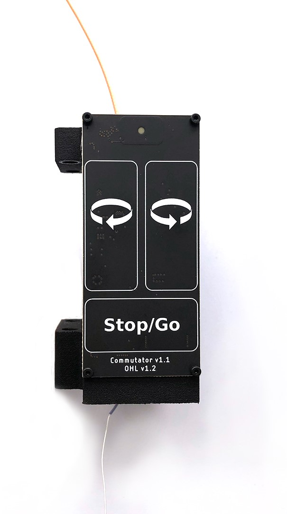

.. _overview:
.. role:: raw-html-m2r(raw)
   :format: html

***********************************
Overview: How Our Commutators Work
***********************************

The tether from the animal’s headstage or miniscope connects to the commutator, and the commutator is connected via a cable to the acquisition system (PCIe host, DAQ, acquisition board), connected in turn to a host computer. The host computer controls and powers the commutator via a USB connection.

The orientation data from the animal is sent to the host computer in real-time. Software such as Bonsai (link) can be used to send commands to the commutator via its USB interface, and the motor in the commutator will turn in the same direction that the animal does.

.. Important::

   This commutator accepts turn commands from two sources:
    1. The serial interface provided by the USB connection
    2. User input from the front panel buttons.

These commands need not depend on the animal’s orientation. It is up to the user to make sure they do, using information from a headstage or miniscope IMU or video based tracking. All of these methods are detailed in these docs and examples are provided. 

A high-quality rotary joint inside the commutator maintains electrical connectivity for both power and high-frequency data signals between the tether leading to the head-mounted device and the cable leading back to the acquisition system while turning.
